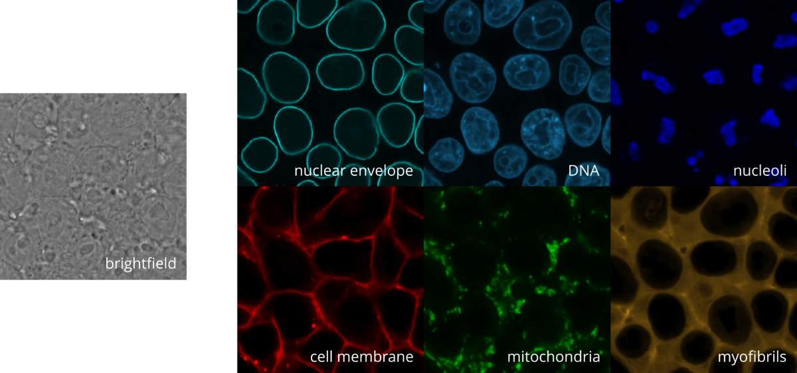

# Wasserstein GAN for three-dimensional multi-channel virtual fluorescent staining

In this repository, we provide the code for the Wasserstein GAN for three-dimensional multi-channel virtual fluorescent staining. 

## Overview



The model performs simultaneous fluorescence staining predictions on multiple channels corresponding to different cellular structures. The model takes as input three-dimensional patches of brightfield images and outputs three-dimensional patches of the target channels. The model is trained as a Wasserstein GAN with gradient penalty (WGAN-GP), where the generator is a U-Net and the critic follows the design of a Patch-GAN discriminator that penalizes unrealistic structure only at the scale of image patches. The generator is trained to minimize a loss that combines the per-channel $L^1$ distance between predictions and targets and the loss computed by the Critic.

To evaluate the quality of the predictions, a classifier is used to provide the generator with a perceptual classification metric. The idea is that the more realistic the generated images, the more accurate a classifier trained on real images will be in classifying the synthesized images. 
The classifier is a ResNet trained on 3D patches of the target channels, with the goal of classifying the patches according to the structure they show. The classifier is trained on the same dataset used to train the generator.

The model is trained on the [Allen Institute for Cell Science](https://www.allencell.org/) hiPSC Single-Cell Image Dataset introduced in [Viana, M.P., Chen, J., Knijnenburg, T.A. et al. Integrated intracellular organization and its variations in human iPS cells. Nature 613, 345–354 (2023). https://doi.org/10.1038/s41586-022-05563-7], preprocessed as described below.

--------

## How to run

The code is organized as follows:  
- `model/`: Definitions of the generator, the critic, the WGAN combining the two, and the classifier
- `utils/`: The definition of various useful functions
- `data/`: The definition of the dataset and the dataloader
- `process_single_final.py`: The script to process the dataset
- `train_n2v.py`: The script to train the noise2void denoisers models
- `denoise_dataset.py`: The script to denoise the dataset
- `train.py`: The script to train the model
- `inference.py`: The script to perform inference on a single image
- `train_classifier.py`: The script to train the classifier


### Preprocessing

The preprocessing on the dataset is performed in two steps: 

1) The first step is to download the files from the `aics/hipsc_single_cell_image_dataset` S3 and process them by selecting the in-focus slices and converting each sample to the zarr format. To do so, run the following command:

```shell
python process_single_final.py --dest_dir <path_to_dest_dir>
```
With the following optional arguments:

- `-l` or `--file_limit_per_structure` : The number of files to process for each structure. Default is `-1`, meaning that all the files will be processed.

- `-p` or `--parallel` : Number of parallel processes to use. Default is `4`.

- `-z` or `--as-zip` : Whether to save the zarr files as zip. Default is `False`.

- `-s` or `--structure` : If you want to process only a single structure. Default is `None`, meaning that all the structures will be processed.

- `-i` or `--fovid` : If you want to process only a single fov. Default is `None`, meaning that all the fovs will be processed.

2) The second step is to denoise the target channels using the noise2void models. To do so, run the following command to train the n2v models:

```shell
python train_n2v.py
```
It's possible to pass as arguments whether to train the n2v models on the DNA, cell_membrane and on the channel representing the specific structures we are interested in. By default, the script will train the n2v models on every target channel and every structure we will use to train our model.

Then, run the following command to denoise the dataset:

```shell
python denoise_dataset.py --src_dir <path_to_src_dir> --target_dir <path_to_target_dir>
```
The script will denoise the target channels using the source channel as input, and the trained n2v models saved in the  "n2v_models/" folder. The denoised images will be saved in the target_dir. 


### Training

To train the model, run the following command:

```shell
python train.py
```
The following optional arguments are available:
- `-d` or `--dataset` : The path to the dataset. We used the [Allen Institute for Cell Science](https://www.allencell.org/) hiPSC Single-Cell Image Dataset introduced in [Viana, M.P., Chen, J., Knijnenburg, T.A. et al. Integrated intracellular organization and its variations in human iPS cells. Nature 613, 345–354 (2023). https://doi.org/10.1038/s41586-022-05563-7], preprocessed as described below.

- `-s` or `--structures_of_interest` : A list containing the names of the genes corresponding to the structures of interest from the dataset. Default = ["TOMM20", "ACTB", "MYH10", "ACTN1", "LMNB1", "FBL", "NPM1"]. Corresponding to the following structures: ["mitochondria", "actin_filaments", "actomyosin_bundles", "actin_bundles","nuclear_envelope", "nucleoli(DFC)", "nucleoli(GC)"]. "DNA" and "cell_membrane" are always selected since they are present in all the images.
 
- `-e` or `--epochs` : The number of epochs to train the model. Default is 10.

- `-bs_t` or `--batch_size_training` : The batch size used for training. Default is 16

- `-bs` or `--batch_size` : The batch size used for test and validation. Default is 2.

- `-ps_t` or `--patch_shape_training` : The patch shape used for training. Default is (16,128,128).

- `-ps` or `--patch_shape` : The patch shape used for test and validation. Default is (16,384,384).

- `-pst_t` or `--patch_stride_training` : The patch stride used for training. Default is (8,64,64).

- `-pst` or `--patch_stride` : The patch stride used for test and validation. Default is (16,384,384).

- `-z` or `--z_range` : How to select the z slices. Default is "in-focus-centre": take only the central slices of in-focus portion. Other options are (in-focus-hint,n): select all the slices with a stride of n.

- `-adv` or `--adversarial_training` : Wheter to use adversarial training. Default is True.

- `-lr_g` or `--learning_rate_generator` : The learning rate for the generator. Default is 0.00005.

- `-lr_c` or `--learning_rate_critic` : The learning rate for the discriminator. Default is 0.00005.

- `-ns_g` or `--negative_slope_generator` : The negative slope for the generator. Default is 0.05.

- `-ns_c` or `--negative_slope_critic` : The negative slope for the discriminator. Default is 0.05.

- `-c` or `--classification_metric` : Wheter to use classification metric. Default is True.

- `--classifier` : Path to the torch lightining checkpoint of the classifier to use. To train the classifier, run the following command:

```shell
python train_classifier.py --dataset <path_to_dataset>
```
It's possible to adjust the classifier training with many optional argments, that can be found in the parser_arguments.py file, under the function "add_train_classifier_arguments".

- `-nw` or `--num_workers` : The number of workers to use for data loading. Default is 8.

- `-pf` or `--prefetch_factor` : The number of batches to prefetch. Default is 4.

- `-ckpt` or `--checkpoint` : The path to the checkpoint to load to resume training from. Default is None.

- `--seed` : The seed to use for reproducibility. Default is 13.

- `--gpuid` : The id of the gpu to use. Default is 0.

- `--deterministic` : Whether to use deterministic training. Default is False.

- `--benchmark`: Whether to use Lightning benchmark mode. Default is True

- `--per_process_memory_fraction` : The fraction used to limit allocated memory on a CUDA device. Default is 1.

### Inference

To perform inference, run the following command:

```shell
python inference.py 
```
With the following required arguments:

- `-i` or `--img_path` : The path to the image to perform inference on. The code assumes a .zarr file as input, with dimensions (C,Z,Y,X).

- `-m` or `--model_path` : The path to the model to use for inference. The code assumes a .tar file generated by the train.py script, where are also stored the hyperparameters of the generator model.

- `-o` or `--output` : The name/path of the output file

The following optional arguments are available:

- `-of` or `--output_format` : The format of the output file. Default is "tiff", other option is "zarr". Respectively to save the output as a .ome.tiff file or a .ome.zarr file.

- `-s` or `--section` : The section of the image to perform inference on, in the format ((z_start, y_start, x_start), (z_end, y_end, x_end)). Default is ((24,0,0), (40,512,512)). Note that it's often the case that the whole image is too large to fit in memory, so it's necessary to perform inference on sections of the image. The size in each dimension of the section should be a multiple of 8.

- `-src` or `--source` : Int representing the position of the source channel in the input image. Default is 3, since in our dataset the brightfield (source) channel is the fourth one.

## License

All work is licensed under CC BY-NC-ND 4.0 https://creativecommons.org/licenses/by-nc-nd/4.0/

